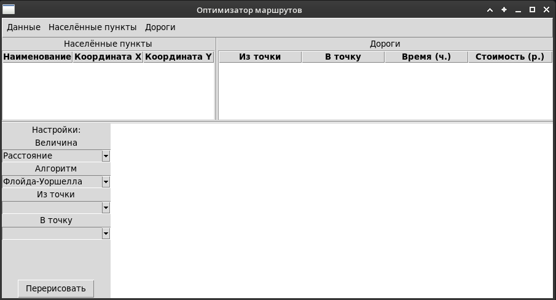
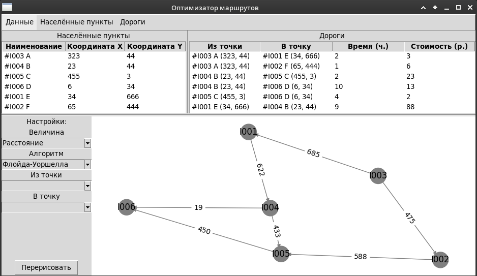
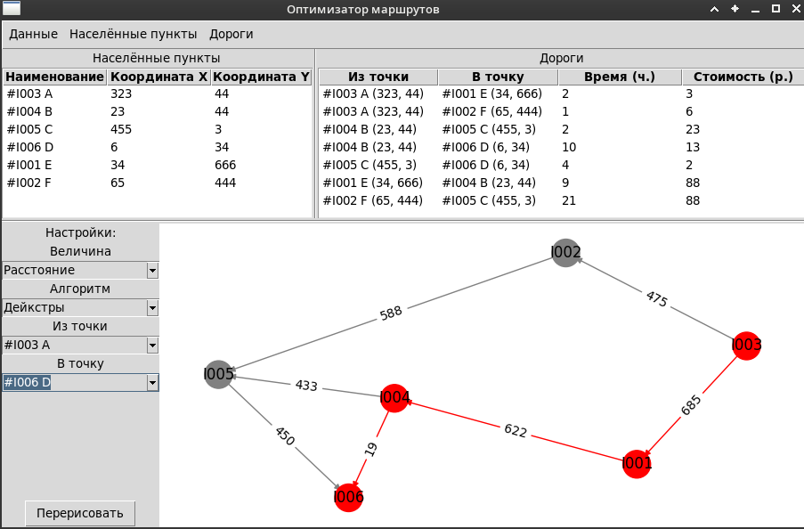
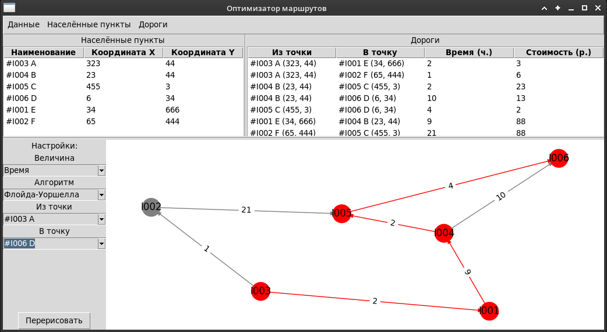

# Алгоритмы и структуры данных. Итоговый практикум. Оптимизация маршрута доставки

## Назначение


Данное приложение позволяет определить оптимальный маршрут доставки между несколькими пунктами с использованием алгоритмов
графов:
- Алгоритм Флойда-Уоршелла для нахождения кратчайших путей между всеми парами узлов
- Алгоритм Дейкстры для нахождения кратчайшего пути между двумя узлами

Маршшрут от начального пункта до конечного представляет набор путей (рёбер граафа) между населёнными пунктами. Для каждого пути кроме расстояния между точками (по координатам) также  доступно указание таких параметров как время в пути и стоимость доставки по этому маршруту. Оптимизация производится по одному из указанных парметров.

Внешний вид приложения представлен на рис.1

<br>*Рис 1. Внешний вид приложения*

Приложение разделено на две части:
* Область ввода/редактирования исходных данные представлена двумя табличными элементами (слева список населённых пунктов, справа список дорог)
* Область настроек рассчётов оптимизации отображение графа с оптимальным маршрутом. В этом блоке доступны к выбору: оптимизируемая величина, оптимизирующий алгоритм, а также можно указать начальную и конечную точки (населённые пункты) для построения оптимального маршрута.

Кнопка "Перерисовать" предназначена для подбора оптимального расположения населённых пунтов (вершин) и дорог (рёбер) графа на изображении справа от формы настроек.

## Меню

Меню приложения представлено в виде трёх групп подменю:
- Данные - Основной пункт для управление сохранением и загрузкой данных с диска. В эту группу также входят пункт "Новый", предназначенный для очистки списков, и пункт "Выход" - для завершение работы приложения.
- Населённые пункты - добавление/удаление населённых пунктов (вершины графа)
- Дороги - добавление/удаление дорог между населёнными пунктами (рёбра графа)

## Подготовка к запуску и запуск

Для корректного запуска приложения необходимо установить все зависимости из файла **requirements.txt**. Для этого нужно запустить на выплнение пакетный менеджер следующим образом ```pip install -r requirements.txt``` Команда для запуска приложния ```python optigraph.py```

## Загрузка и сохранение данных

Приложение допускает сохранение и восстановление в файлы с расширением ".data" в формате json. Имя файла данных берётся на основе имени файла запускаемого модуля приложения.
В качестве примеров исходных данных доступны два набора: [раз](optigraph-1.data) и [два](optigraph-1.data). Для их использования нужно создать симводлическую ссылку с любого из этих файлов на файл **optigraph-1.data** используя одну из команд ```ls -s optigraph-1.data optigraph.data``` или ```ls -s optigraph-2.data optigraph.data```

## Манипулирование даннными

Каждый набор данных (Населённые пункты - слева, Дороги - справа) допускают полный цикл управления: можно добавлять, удалять и редактировать введённые ранее данные прям в приложении. Добавление новых и удаление ненужных строк производится через основное меню приложения. Редактирование наборов происходит по двойному клику на этом наборе. Перед удалением ненужного пункта - его нужно подсветить мышкой (выделить строку в таблице). Допускатеся групповое удаление (нескольких строк в одном наборе). Так как данные дорог  напрямую зависят от населённых пунктов, при изменении в наборе населённых пунктов - состав дорог корректируется автоматически. Полное удаление всех данных достигается выбором пункта меню "Новый" в групе "Данные" основного меню приложения. Внешний вид приложения с загруженными данными представлено на рис. 2.

<br>*Рис 2. Внешний вид приложения с загруженными данными*

## Процесс оптимизации

При наличии данных в приложении после выбора нужного алгоритма оптимизации выполнеяется рассчёт оптимальных маршрутов:
* для варианта с оптимизацией по алгоритму Флойда-Уоршелла - просчитываются все маршруты между всеми населёнными пунктами.
* для алгоритма Дейкстры рассчёт производится после выбора начального пункта маршрута (поле "из точки").

Далее справа от формы настроек параметров рассчёта оптимальный маршрут отображается красными рёбрами на графе (рис. 3, 4)
<br>
*Рис 3. Внешний вид приложения с оптимизированным маршрутом по расстоянию по Дейкстре*<br>
<br>
*Рис 4. Внешний вид приложения с оптимизированным маршрутом по времени по Флойду-Уоршеллу*


